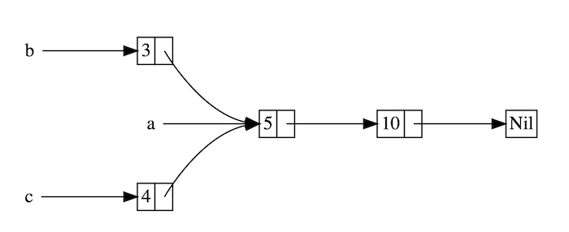
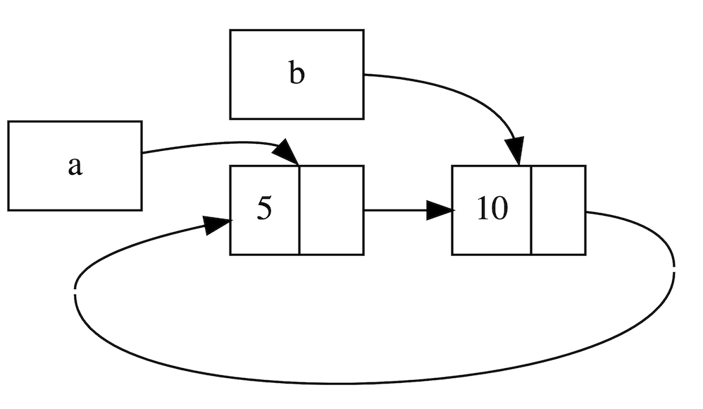

### 循环引用和自引用

#### Weak与循环引用

> Rust 的安全性是众所周知的，但是不代表它不会内存泄漏。一个典型的例子就是同时使用 `Rc<T>`和 `RefCell<T>`创建循环引用，最终这些引用的计数都无法被归零，因此 `Rc<T>`拥有的值也不会被释放清理

##### 何为循环引用

```rust
use crate::List::{Cons, Nil};
use std::cell::RefCell;
use std::rc::Rc;

#[derive(Debug)]
enum List {
    Cons(i32, RefCell<Rc<List>>),
    Nil,
}

impl List {
    fn tail(&self) -> Option<&RefCell<Rc<List>>> {
        match self {
            Cons(_, item) => Some(item),
            Nil => None,
        }
    }
}

fn main() {
    let a = Rc::new(Cons(5, RefCell::new(Rc::new(Nil))));

    println!("a的初始化rc计数 = {}", Rc::strong_count(&a));
    println!("a指向的节点 = {:?}", a.tail());

    // 创建`b`到`a`的引用
    let b = Rc::new(Cons(10, RefCell::new(Rc::clone(&a))));

    println!("在b创建后，a的rc计数 = {}", Rc::strong_count(&a));
    println!("b的初始化rc计数 = {}", Rc::strong_count(&b));
    println!("b指向的节点 = {:?}", b.tail());

    // 利用RefCell的可变性，创建了`a`到`b`的引用
    if let Some(link) = a.tail() {
        *link.borrow_mut() = Rc::clone(&b);
    }

    println!("在更改a后，b的rc计数 = {}", Rc::strong_count(&b));
    println!("在更改a后，a的rc计数 = {}", Rc::strong_count(&a));

    // 下面一行println!将导致循环引用
    // 我们可怜的8MB大小的main线程栈空间将被它冲垮，最终造成栈溢出
    // println!("a next item = {:?}", a.tail());
}
```



1. 在创建了 `a`后，紧接着就使用 `a`创建了 `b`，因此 `b`引用了 `a`
2. 然后我们又利用 `Rc`克隆了 `b`，然后通过 `RefCell`的可变性，让 `a`引用了 `b`



##### Weak

`Weak`非常类似于 `Rc`，但是与 `Rc`持有所有权不同，`Weak`不持有所有权，它仅仅保存一份指向数据的**弱引用**

- 如果你想要访问数据，需要通过 `Weak`指针的 `upgrade`方法实现，该方法返回一个类型为 `Option<Rc<T>>`的值
- **不保证引用关系依然存在** ，如果不存在，就返回一个 `None`
- 因为 `Weak`引用不计入所有权，因此它**无法阻止所引用的内存值被释放掉**

###### Weak与Rc对比

| `Weak`                                           | `Rc`                                     |
| -------------------------------------------------- | ------------------------------------------ |
| 不计数                                             | 引用计数                                   |
| 不拥有所有权                                       | 拥有值的所有权                             |
| 不阻止值被释放(drop)                               | 所有权计数归零，才能drop                   |
| 引用的值存在返回 `Some`，不存在返回 `None`     | 引用的值必定存在                           |
| 通过 `upgrade`取到 `Option<Rc<T>>`，然后再取值 | 通过 `Deref`自动解引用，取值无需任何操作 |

`Weak`适合实现：

* 持有一个 `Rc`对象的临时引用，并且不在乎引用的值是否依然存在
* 阻止 `Rc`导致的循环引用，因为 `Rc`的所有权机制，会导致多个 `Rc`都无法计数归零

> **对于父子引用关系，可以让父节点通过 `Rc`来引用子节点，然后让子节点通过 `Weak`来引用父节点**

###### Weak总结

`Weak`通过 `use std::rc::Weak`来引入，它具有以下特点:

* 可访问，但没有所有权，不增加引用计数，因此不会影响被引用值的释放回收
* 可由 `Rc<T>`调用 `downgrade`方法转换成 `Weak<T>`
* `Weak<T>`可使用 `upgrade`方法转换成 `Option<Rc<T>>`，如果资源已经被释放，则 `Option`的值是 `None`
* 常用于解决循环引用的问题

```rust
use std::rc::Rc;
fn main() {
    // 创建Rc，持有一个值5
    let five = Rc::new(5);

    // 通过Rc，创建一个Weak指针
    let weak_five = Rc::downgrade(&five);

    // Weak引用的资源依然存在，取到值5
    let strong_five: Option<Rc<_>> = weak_five.upgrade();
    assert_eq!(*strong_five.unwrap(), 5);

    // 手动释放资源`five`
    drop(five);

    // Weak引用的资源已不存在，因此返回None
    let strong_five: Option<Rc<_>> = weak_five.upgrade();
    assert_eq!(strong_five, None);
}
```

##### 使用Weak解决循环引用

```rust
use std::rc::Rc;
use std::rc::Weak;
use std::cell::RefCell;

// 主人
struct Owner {
    name: String,
    gadgets: RefCell<Vec<Weak<Gadget>>>,
}

// 工具
struct Gadget {
    id: i32,
    owner: Rc<Owner>,
}

fn main() {
    // 创建一个 Owner
    // 需要注意，该 Owner 也拥有多个 `gadgets`
    let gadget_owner : Rc<Owner> = Rc::new(
        Owner {
            name: "Gadget Man".to_string(),
            gadgets: RefCell::new(Vec::new()),
        }
    );

    // 创建工具，同时与主人进行关联：创建两个 gadget，他们分别持有 gadget_owner 的一个引用。
    let gadget1 = Rc::new(Gadget{id: 1, owner: gadget_owner.clone()});
    let gadget2 = Rc::new(Gadget{id: 2, owner: gadget_owner.clone()});

    // 为主人更新它所拥有的工具
    // 因为之前使用了 `Rc`，现在必须要使用 `Weak`，否则就会循环引用
    gadget_owner.gadgets.borrow_mut().push(Rc::downgrade(&gadget1));
    gadget_owner.gadgets.borrow_mut().push(Rc::downgrade(&gadget2));

    // 遍历 gadget_owner 的 gadgets 字段
    for gadget_opt in gadget_owner.gadgets.borrow().iter() {

        // gadget_opt 是一个 Weak<Gadget> 。 因为 weak 指针不能保证他所引用的对象
        // 仍然存在。所以我们需要显式的调用 upgrade() 来通过其返回值(Option<_>)来判
        // 断其所指向的对象是否存在。
        // 当然，Option 为 None 的时候这个引用原对象就不存在了。
        let gadget = gadget_opt.upgrade().unwrap();
        println!("Gadget {} owned by {}", gadget.id, gadget.owner.name);
    }

    // 在 main 函数的最后，gadget_owner，gadget1 和 gadget2 都被销毁。
    // 具体是，因为这几个结构体之间没有了强引用（`Rc<T>`），所以，当他们销毁的时候。
    // 首先 gadget2 和 gadget1 被销毁。
    // 然后因为 gadget_owner 的引用数量为 0，所以这个对象可以被销毁了。
    // 循环引用问题也就避免了
}
```

```rust
use std::cell::RefCell;
use std::rc::{Rc, Weak};

#[derive(Debug)]
struct Node {
    value: i32,
    parent: RefCell<Weak<Node>>,
    children: RefCell<Vec<Rc<Node>>>,
}

fn main() {
    let leaf = Rc::new(Node {
        value: 3,
        parent: RefCell::new(Weak::new()),
        children: RefCell::new(vec![]),
    });

    println!(
        "leaf strong = {}, weak = {}",
        Rc::strong_count(&leaf),
        Rc::weak_count(&leaf),
    );

    {
        let branch = Rc::new(Node {
            value: 5,
            parent: RefCell::new(Weak::new()),
            children: RefCell::new(vec![Rc::clone(&leaf)]),
        });

        *leaf.parent.borrow_mut() = Rc::downgrade(&branch);

        println!(
            "branch strong = {}, weak = {}",
            Rc::strong_count(&branch),
            Rc::weak_count(&branch),
        );

        println!(
            "leaf strong = {}, weak = {}",
            Rc::strong_count(&leaf),
            Rc::weak_count(&leaf),
        );
    }

    println!("leaf parent = {:?}", leaf.parent.borrow().upgrade());
    println!(
        "leaf strong = {}, weak = {}",
        Rc::strong_count(&leaf),
        Rc::weak_count(&leaf),
    );
}
```

##### unsafe解决循环引用

还可以使用 `unsafe`里的裸指针来解决这些棘手的问题

```rust
// 使用原生指针和unsafe实现自引用
pub struct Tree {
    count: usize,
    root: *mut Node,
}

#[derive(Debug)]
struct Node {
    data: i32,

    // Null指针这里代表"None`; right.is_null() ==> 没有right child
    left: *mut Node,
    right: *mut Node,
    parent: *mut Node,
}

impl Tree {
    pub fn new() -> Self {
        Self {
            count: 0,
            root: std::ptr::null_mut(),
        }
    }

    // 返回tree的节点数量
    pub fn node_count(&self) -> usize {
        assert!(self.count != 0 || self.root.is_null());
        self.count
    }


    // 在tree中新增一项，插入成功则返回true,若给定的数据在tree上已经存在，则返回false
    pub fn insert(&mut self, data: i32) -> bool {
        if self.root.is_null() {
            self.root = Node::new(data);
        } else {
            if !insert_node(self.root, data) {
                return false;
            }
        }

        self.count += 1;
        true
    }

    // 找到tree上的指定项，若找到，返回true
    pub fn find(&self, data: i32) -> bool {
        !find_node(self.root, data).is_null()
    }

    // 返回tree的字符串形式，用于Debug
    pub fn display(&self) -> String {
        display_node(self.root, 0)
    }

    // 使用中序遍历来返回tree中的所有数据
    pub fn inorder(&self) -> Vec<i32> {
        let mut v = vec![];
        if !self.root.is_null() {
            let mut node = leftmost_child(self.root);
            loop {
                if node.is_null() {
                    break;
                }
                unsafe {
                    v.push((*node).data);
                }
                node = successor_of_node(node);
            }
        }
        v
    }

    // 从tree上移除指定项, 若该项存在且被成功移除，则返回true，否则都返回false
    pub fn remove(&mut self, data: i32) -> bool {
        let node = find_node(self.root, data);
        if node.is_null() {
            false
        } else {
            self.remove_node(node);
            self.count -= 1;
            true
        }
    }

    // 在tree上找到指定项的继任者
    pub fn successor(&self, data: i32) -> Option<i32> {
        unsafe {
            let node = find_node(self.root, data);
            if !node.is_null() {
                let nodesucc = successor_of_node(node);
                if !nodesucc.is_null() {
                    return Some((*nodesucc).data);
                }
            }
            None
        }
    }

    // 从tree上移除指定的节点
    fn remove_node(&mut self, node: *mut Node) {
        unsafe {
            let lchild = (*node).left;
            let rchild = (*node).right;
            if lchild.is_null() && rchild.is_null() {
                // 节点没有子节点，所以可以安全移除
                self.replace_node(node, std::ptr::null_mut());
            } else if !lchild.is_null() && !rchild.is_null() {
                // 节点的左右子节点都在，我们需要找到该节点的继任者，然后将继任者的数据赋给当前节点，然后再递归删除继任者
                let succ = successor_of_node(node);
                assert!(!succ.is_null());
                (*node).data = (*succ).data;
                self.remove_node(succ);
            } else if !lchild.is_null() {
                // 节点只有左子节点，所以使用后者替代前者
                self.replace_node(node, lchild);
            } else if !rchild.is_null() {
                // 节点只有右子节点，所以使用后者替代前者
                self.replace_node(node, rchild);
            } else {
                panic!("unreachable");
            }
        }
    }

    // 使用`r`节点来替换目标`node`节点
    fn replace_node(&mut self, node: *mut Node, r: *mut Node) {
        unsafe {
            let parent = (*node).parent;
            if parent.is_null() {
                // Removing the root node.
                self.root = r;
                if !r.is_null() {
                    (*r).parent = std::ptr::null_mut();
                }
            } else {
                if !r.is_null() {
                    (*r).parent = parent;
                }
                if (*parent).left == node {
                    (*parent).left = r;
                } else if (*parent).right == node {
                    (*parent).right = r;
                }
            }

            // 被替换的节点不再被使用，因此可以回收它：通过`Box`拿走它的所有权，然后它会被自动drop
            Box::from_raw(node);
        }
    }
}

impl Drop for Tree {
    fn drop(&mut self) {
        // 也许不是性能最高的实现，但是简单，而且有用
        while !self.root.is_null() {
            self.remove_node(self.root);
        }
    }
}

impl Node {
    fn new(data: i32) -> *mut Self {
        Box::into_raw(Box::new(Self {
            data,
            left: std::ptr::null_mut(),
            right: std::ptr::null_mut(),
            parent: std::ptr::null_mut(),
        }))
    }

    fn new_with_parent(data: i32, parent: *mut Node) -> *mut Self {
        Box::into_raw(Box::new(Self {
            data,
            left: std::ptr::null_mut(),
            right: std::ptr::null_mut(),
            parent,
        }))
    }
}

// 在节点子树上创建新的节点
fn insert_node(node: *mut Node, data: i32) -> bool {
    unsafe {
        if (*node).data == data {
            false
        } else if data < (*node).data {
            if (*node).left.is_null() {
                (*node).left = Node::new_with_parent(data, node);
                true
            } else {
                insert_node((*node).left, data)
            }
        } else {
            if (*node).right.is_null() {
                (*node).right = Node::new_with_parent(data, node);
                true
            } else {
                insert_node((*node).right, data)
            }
        }
    }
}

// 在`fromnode`的子树上寻找目标数据，如果没找到则返回`null`
fn find_node(fromnode: *mut Node, data: i32) -> *mut Node {
    unsafe {
        if fromnode.is_null() || (*fromnode).data == data {
            fromnode
        } else if data < (*fromnode).data {
            find_node((*fromnode).left, data)
        } else {
            find_node((*fromnode).right, data)
        }
    }
}


// 返回`node`子树的字符串形式，同时指定缩进字符数
fn display_node(node: *const Node, indent: usize) -> String {
    let indent_str = " ".repeat(indent);
    if node.is_null() {
        indent_str + ".\n"
    } else {
        unsafe {
            let mut s = format!("{}{}\n", indent_str, (*node).data);
            s.push_str(&display_node((*node).left, indent + 2));
            s.push_str(&display_node((*node).right, indent + 2));
            s
        }
    }
}

// 找到`node`最左边的子节点，如果没有，就返回`node`自身, `node`不能为null
fn leftmost_child(node: *mut Node) -> *mut Node {
    unsafe {
        if (*node).left.is_null() {
            node
        } else {
            leftmost_child((*node).left)
        }
    }
}


// 在tree上找到`node`的继任者
fn successor_of_node(node: *mut Node) -> *mut Node {
    unsafe {
        if !(*node).right.is_null() {
            // 若node有一个右子节点，则继任者是该右子节点的最左子节点，若该右子节点没有子节点，则继任者就是右子节点
            leftmost_child((*node).right)
        } else {
            // 没有右子节点，则找到一个父节点，当前node是该父节点的左子节点, 若在root之前都没找到，说明node没有继任者
            parent_with_left(node)
        }
    }
}

// 在`node`的祖先中找到它的父节点,且`node`必须是该父节点的左子节点
fn parent_with_left(node: *mut Node) -> *mut Node {
    unsafe {
        // 若`node`有父节点，且该父节点拥有左子节点，同时`node`就是这个左子节点，那么该父节点就是我们的目标
        let parent = (*node).parent;
        if !parent.is_null() {
            if std::ptr::eq((*parent).left, node) {
                return parent;
            }
            return parent_with_left(parent);
        }

        // `node`没有父节点
        std::ptr::null_mut()
    }
}

fn main() {
  
}
```

虽然 `unsafe`不安全，但是在各种库的代码中依然很常见用它来实现自引用结构，主要优点如下:

* 性能高，毕竟直接用裸指针操作
* 代码更简单更符合直觉: 对比下 `Option<Rc<RefCell<Node>>>`

#### 结构体中的自引用

##### 平平无奇的自引用

```rust
struct SelfRef<'a> {
    value: String,

    // 该引用指向上面的value
    pointer_to_value: &'a str,
}

fn main(){
    let s = "aaa".to_string();
    let v = SelfRef {
        value: s, // Error
        pointer_to_value: &s
    };
}
```

- 试图同时使用值和值的引用，最终所有权转移和借用一起发生了

##### 使用Option

使用 `Option` 分两步来实现

```rust
#[derive(Debug)]
struct WhatAboutThis<'a> {
    name: String,
    nickname: Option<&'a str>,
}

fn main() {
    let mut tricky = WhatAboutThis {
        name: "Annabelle".to_string(),
        nickname: None,
    };
    tricky.nickname = Some(&tricky.name[..4]);

    println!("{:?}", tricky);
}
```

限制较多，例如从一个函数创建并返回它是不可能的：

```rust
fn creator<'a>() -> WhatAboutThis<'a> {
    let mut tricky = WhatAboutThis {
        name: "Annabelle".to_string(),
        nickname: None,
    };
    tricky.nickname = Some(&tricky.name[..4]); // Error

    tricky
}
```

如果是通过方法使用，你需要一个无用 `&'a self`生命周期标识，一旦有了这个标识，代码将变得更加受限，你将很容易就获得借用错误，就连NLL规则都没用

```rust
#[derive(Debug)]
struct WhatAboutThis<'a> {
    name: String,
    nickname: Option<&'a str>,
}

impl<'a> WhatAboutThis<'a> {
    fn tie_the_knot(&'a mut self) {
       self.nickname = Some(&self.name[..4]);
    }
}

fn main() {
    let mut tricky = WhatAboutThis {
        name: "Annabelle".to_string(),
        nickname: None,
    };
    tricky.tie_the_knot();

    // cannot borrow `tricky` as immutable because it is also borrowed as mutable
    // println!("{:?}", tricky);
}
```

##### unsafe实现

```rust
#[derive(Debug)]
struct SelfRef {
    value: String,
    pointer_to_value: *const String,
}

impl SelfRef {
    fn new(txt: &str) -> Self {
        SelfRef {
            value: String::from(txt),
            pointer_to_value: std::ptr::null(),
        }
    }

    fn init(&mut self) {
        let self_ref: *const String = &self.value;
        self.pointer_to_value = self_ref;
    }

    fn value(&self) -> &str {
        &self.value
    }

    fn pointer_to_value(&self) -> &String {
        assert!(!self.pointer_to_value.is_null(),
            "Test::b called without Test::init being called first");
        unsafe { &*(self.pointer_to_value) }
    }
}

fn main() {
    let mut t = SelfRef::new("hello");
    t.init();
    // 打印值和指针地址
    println!("{}, {:p}", t.value(), t.pointer_to_value());
}
```

- 在 `pointer_to_value`中直接存储裸指针，而不是Rust的引用，因此不再受到Rust借用规则和生命周期的限制
- 缺点就是，通过指针获取值时需要使用 `unsafe`代码

还能通过裸指针来修改 `String`，但是需要将 `*const`修改为 `*mut`

```rust
#[derive(Debug)]
struct SelfRef {
    value: String,
    pointer_to_value: *mut String,
}

impl SelfRef {
    fn new(txt: &str) -> Self {
        SelfRef {
            value: String::from(txt),
            pointer_to_value: std::ptr::null_mut(),
        }
    }

    fn init(&mut self) {
        let self_ref: *mut String = &mut self.value;
        self.pointer_to_value = self_ref;
    }

    fn value(&self) -> &str {
        &self.value
    }

    fn pointer_to_value(&self) -> &String {
        assert!(!self.pointer_to_value.is_null(), "Test::b called without Test::init being called first");
        unsafe { &*(self.pointer_to_value) }
    }
}

fn main() {
    let mut t = SelfRef::new("hello");
    t.init();
    println!("{}, {:p}", t.value(), t.pointer_to_value());

    t.value.push_str(", world");
    unsafe {
        (&mut *t.pointer_to_value).push_str("!");
    }

    println!("{}, {:p}", t.value(), t.pointer_to_value());
}
```

虽然简单好用，但是它不太安全

##### 无法被移动的Pin

可以固定住一个值，防止该值在内存中被移动

自引用最麻烦的就是创建引用的同时，值的所有权会被转移，而通过 `Pin` 就可以很好的防止这一点

```rust
use std::marker::PhantomPinned;
use std::pin::Pin;
use std::ptr::NonNull;

// 下面是一个自引用数据结构体，因为 slice 字段是一个指针，指向了 data 字段
// 我们无法使用普通引用来实现，因为违背了 Rust 的编译规则
// 因此，这里我们使用了一个裸指针，通过 NonNull 来确保它不会为 null
struct Unmovable {
    data: String,
    slice: NonNull<String>,
    _pin: PhantomPinned,
}

impl Unmovable {
    // 为了确保函数返回时数据的所有权不会被转移，我们将它放在堆上，唯一的访问方式就是通过指针
    fn new(data: String) -> Pin<Box<Self>> {
        let res = Unmovable {
            data,
            // 只有在数据到位时，才创建指针，否则数据会在开始之前就被转移所有权
            slice: NonNull::dangling(),
            _pin: PhantomPinned,
        };
        let mut boxed = Box::pin(res);

        let slice = NonNull::from(&boxed.data);
        // 这里其实安全的，因为修改一个字段不会转移整个结构体的所有权
        unsafe {
            let mut_ref: Pin<&mut Self> = Pin::as_mut(&mut boxed);
            Pin::get_unchecked_mut(mut_ref).slice = slice;
        }
        boxed
    }
}

fn main() {
    let unmoved = Unmovable::new("hello".to_string());
    // 只要结构体没有被转移，那指针就应该指向正确的位置，而且我们可以随意移动指针
    let mut still_unmoved = unmoved;
    assert_eq!(still_unmoved.slice, NonNull::from(&still_unmoved.data));

    // 因为我们的类型没有实现 `Unpin` 特征，下面这段代码将无法编译
    // let mut new_unmoved = Unmovable::new("world".to_string());
    // std::mem::swap(&mut *still_unmoved, &mut *new_unmoved);
}
```

- 最关键的还是里面的裸指针的使用，而 `Pin`起到的作用就是确保我们的值不会被移走，否则指针就会指向一个错误的地址

##### 使用ouroboros

三方库也有支持的，其中一个就是[ouroboros](https://github.com/joshua-maros/ouroboros)

```rust
use ouroboros::self_referencing;

#[self_referencing]
struct SelfRef {
    value: String,

    #[borrows(value)]
    pointer_to_value: &'this str,
}

fn main(){
    let v = SelfRefBuilder {
        value: "aaa".to_string(),
        pointer_to_value_builder: |value: &String| value,
    }.build();

    // 借用value值
    let s = v.borrow_value();
    // 借用指针
    let p = v.borrow_pointer_to_value();
    // value值和指针指向的值相等
    assert_eq!(s, *p);
}
```

- 需要你去按照它的方式创建结构体和引用类型：`SelfRef` 变成 `SelfRefBuilder`，引用字段从 `pointer_to_value` 变成 `pointer_to_value_builder`，并且连类型都变了
- 在使用时，通过 `borrow_value` 来借用 `value` 的值，通过 `borrow_pointer_to_value` 来借用 `pointer_to_value` 这个指针

```rust
use ouroboros::self_referencing;

#[self_referencing]
struct MyStruct {
    int_data: i32,
    float_data: f32,
    #[borrows(int_data)]
    int_reference: &'this i32,
    #[borrows(mut float_data)]
    float_reference: &'this mut f32,
}

fn main() {
    let mut my_value = MyStructBuilder {
        int_data: 42,
        float_data: 3.14,
        int_reference_builder: |int_data: &i32| int_data,
        float_reference_builder: |float_data: &mut f32| float_data,
    }.build();

    // Prints 42
    println!("{:?}", my_value.borrow_int_data());
    // Prints 3.14
    println!("{:?}", my_value.borrow_float_reference());
    // Sets the value of float_data to 84.0
    my_value.with_mut(|fields| {
        **fields.float_reference = (**fields.int_reference as f32) * 2.0;
    });

    // We can hold on to this reference...
    let int_ref = *my_value.borrow_int_reference();
    println!("{:?}", *int_ref);
    // As long as the struct is still alive.
    drop(my_value);
    // This will cause an error!
    // println!("{:?}", *int_ref);
}
```

> 破坏了原有的结构，另外就是并不是所有数据类型都支持：它需要目标值的内存地址不会改变，因此 `Vec` 动态数组就不适合，因为当内存空间不够时，Rust 会重新分配一块空间来存放该数组，这会导致内存地址的改变

类似的库还有：

* [rental](https://github.com/jpernst/rental)， 这个库其实是最有名的，但是好像不再维护了，用倒是没问题
* [owning-ref](https://github.com/Kimundi/owning-ref-rs)，将所有者和它的引用绑定到一个封装类型

##### Rc+RefCell或Arc+Mutex

类似于循环引用的解决方式，自引用也可以用这种组合来解决，但是会导致代码的类型标识到处都是，大大的影响了可读性

##### 实现链表

[Learn Rust by writing Entirely Too Many Linked Lists](https://rust-unofficial.github.io/too-many-lists/)
