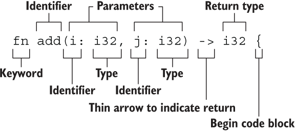

### 函数



```rust
fn add(x: i32, y: i32) -> i32 {
    x + y
}
```

#### 函数要点

- 函数名和变量名使用蛇形命名法，`fn add_two(add_a: i32, add_b: i32) -> i32 { add_a + add_b }`
- 函数的位置可以随便放，只要有定义即可
- 每个函数参数都需要标注类型

#### 函数参数

- Rust 是强类型语言，因此需要你为每一个函数参数都标识出它的具体类型

```rust
fn main() {
    another_function(5, 6.1);
}

fn another_function(x: i32, y: f32) {
    println!("The value of x is: {}", x);
    println!("The value of y is: {}", y);
}

// 去掉任意一个函数参数类型标注都会报错
```

#### 函数返回

- 函数即表达式，可以把函数的返回值直接赋给调用者
- 函数的返回值就是函数体最后一条表达式返回的值，也可以使用 `return`提前返回

```rust
fn plus_five(x: i32) -> i32 {
    x + 5
}

fn main() {
    let x = plus_five(5);
    println!("The value of x is: {}", x);
}
```

1. `let x = plus_five(5);`，说明用一个函数的返回值来初始化变量 `x`，侧面说明在Rust中函数也是表达式，等同于 `let x = 5 + 5;`
2. `x + 5`没有分号，因此它是一个表达式

```rust
// 同时使用return和表达式作为返回值
fn plus_or_minus(x: i32) -> i32 {
    if x > 5 {
        return x - 5
    }
    x + 5
}

fn main() {
    let x = plus_or_minus(5);
    println!("The value of x is: {}", x);
}
```

##### Rust中的特殊返回类型

###### 无返回值()

- 单元类型 `()`，一个零长度的元组，没有任何作用，但可以用于表达一个函数没有返回值
  - 函数没有返回值，那么返回一个 `()`
  - 通过 `;`结尾的语句返回一个 `()`

```rust
// 隐式返回一个()
use std::fmt::Debug;

fn report<T: Debug>(item: T) {
  println!("{:?}", item);

}

// 显式返回一个()
fn clear(text: &mut String) -> () {
  *text = String::from("");
}

// 小心在最后表达式后加上了分号变为语句，导致函数返回值变成()报错
fn add(x:u32,y:u32) -> u32 {
    x + y;
}
```

###### 永不返回的发散函数

- 当用 `!` 作函数返回类型的时候，表示该函数永不返回( diverge function )，特别的，这种语法往往用做会导致程序崩溃的函数

```rust
fn dead_end() -> ! {
  panic!("你已经到了穷途末路，崩溃吧！");
}

// 死循环
fn forever() -> ! {
  loop {
    //...
  };
}
```

### 方法Method

#### 定义方法

Rust 使用 `impl` 来定义方法

```rust
struct Circle {
    x: f64,
    y: f64,
    radius: f64,
}

impl Circle {
    // new是Circle的关联函数，因为它的第一个参数不是self，且new并不是关键字
    // 这种方法往往用于初始化当前结构体的实例
    fn new(x: f64, y: f64, radius: f64) -> Circle {
        Circle {
            x: x,
            y: y,
            radius: radius,
        }
    }

    // Circle的方法，&self表示借用当前的Circle结构体
    fn area(&self) -> f64 {
        std::f64::consts::PI * (self.radius * self.radius)
    }
}

#[derive(Debug)]
struct Rectangle {
    width: u32,
    height: u32,
}

impl Rectangle {
    fn area(&self) -> u32 {
        self.width * self.height
    }
}

fn main() {
    let rect1 = Rectangle { width: 30, height: 50 };

    println!(
        "The area of the rectangle is {} square pixels.",
        rect1.area()
    );
}
```

- `impl Rectangle {}` 表示为 `Rectangle` 实现方法
  - 表明 `impl` 语句块中的一切都是跟 `Rectangle` 相关联的

##### `self`、`&self`和`&mut self`

> `&self` 其实是 `self: &Self` 的简写
>
> 在一个 `impl` 块内，`Self` 指代被实现方法的结构体类型，`self` 指代此类型的实例

`self` 依然有所有权的概念：

* `self` 表示 `Rectangle` 的所有权转移到该方法中，这种形式用的较少
* `&self` 表示该方法对 `Rectangle` 的不可变借用
* `&mut self` 表示可变借用

##### 方法名跟结构体字段名相同

```rust
impl Rectangle {
    fn width(&self) -> bool {
        self.width > 0
    }
}

fn main() {
    let rect1 = Rectangle {
        width: 30,
        height: 50,
    };

    if rect1.width() {
        println!("The rectangle has a nonzero width; it is {}", rect1.width);
    }
}
```

使用 `rect1.width()` 时，Rust 知道我们调用的是它的方法，如果使用 `rect1.width`，则是访问它的字段

- 方法跟字段同名，往往适用于实现 `getter` 访问器

- 可以把 `Rectangle` 的字段设置为私有属性，只需把它的 `new` 和 `width` 方法设置为公开可见，那么用户就可以创建一个矩形，同时通过访问器 `rect1.width()` 方法来获取矩形的宽度，因为 `width` 字段是私有的，当用户访问 `rect1.width` 字段时，就会报错

##### 自动引用和解引用

当使用 `object.something()` 调用方法时，Rust 会自动为 `object` 添加 `&`、`&mut` 或 `*` 以便使 `object` 与方法签名匹配

```rust
p1.distance(&p2);
(&p1).distance(&p2);
```

> 在给出接收者和方法名的前提下，Rust 可以明确地计算出方法是仅仅读取（`&self`），做出修改（`&mut self`）或者是获取所有权（`self`）

#### 关联函数

为结构体定义构造器方法 -- 接受参数构造并返回该结构体实例

- 构造器方法定义参数中不包含 `self`
- 需要用 `::` 来调用
  - 方法位于结构体的命名空间中：`::` 语法用于关联函数和模块创建的命名空间

```rust
impl Rectangle {
    fn new(w: u32, h: u32) -> Rectangle {
        Rectangle { width: w, height: h }
    }
}
```

> 定义在 `impl` 中且没有 `self` 的函数被称之为 **关联函数** ： 因为它没有 `self`，不能用 `f.read()` 的形式调用，因此它是一个函数而不是方法，它又在 `impl` 中，与结构体紧密关联，因此称为关联函数

#### 多个`impl`定义

Rust 允许我们为一个结构体定义多个 `impl` 块，目的是提供更多的灵活性和代码组织性

#### 为枚举实现方法

```rust
#![allow(unused)]
enum Message {
    Quit,
    Move { x: i32, y: i32 },
    Write(String),
    ChangeColor(i32, i32, i32),
}

impl Message {
    fn call(&self) {
        // 在这里定义方法体
    }
}

fn main() {
    let m = Message::Write(String::from("hello"));
    m.call();
}
```

#### 示例

```rust
struct Point {
    x: f64,
    y: f64,
}

// `Point` 的关联函数都放在下面的 `impl` 语句块中
impl Point {
    // 关联函数的使用方法跟构造器非常类似
    fn origin() -> Point {
        Point { x: 0.0, y: 0.0 }
    }

    // 另外一个关联函数，有两个参数
    fn new(x: f64, y: f64) -> Point {
        Point { x: x, y: y }
    }
}

struct Rectangle {
    p1: Point,
    p2: Point,
}

impl Rectangle {
    // 这是一个方法
    // `&self` 是 `self: &Self` 的语法糖
    // `Self` 是当前调用对象的类型，对于本例来说 `Self` = `Rectangle`
    fn area(&self) -> f64 {
        // 使用点操作符可以访问 `self` 中的结构体字段
        let Point { x: x1, y: y1 } = self.p1;
        let Point { x: x2, y: y2 } = self.p2;

  
        // `abs` 是一个 `f64` 类型的方法，会返回调用者的绝对值
        ((x1 - x2) * (y1 - y2)).abs()
    }

    fn perimeter(&self) -> f64 {
        let Point { x: x1, y: y1 } = self.p1;
        let Point { x: x2, y: y2 } = self.p2;

        2.0 * ((x1 - x2).abs() + (y1 - y2).abs())
    }

    // 该方法要求调用者是可变的，`&mut self` 是 `self: &mut Self` 的语法糖
    fn translate(&mut self, x: f64, y: f64) {
        self.p1.x += x;
        self.p2.x += x;

        self.p1.y += y;
        self.p2.y += y;
    }
}

// `Pair` 持有两个分配在堆上的整数
struct Pair(Box<i32>, Box<i32>);

impl Pair {
    // 该方法会拿走调用者的所有权
    // `self` 是 `self: Self` 的语法糖
    fn destroy(self) {
        let Pair(first, second) = self;

        println!("Destroying Pair({}, {})", first, second);

        // `first` 和 `second` 在这里超出作用域并被释放
    }
}

fn main() {
    let rectangle = Rectangle {
        // 关联函数的调用不是通过点操作符，而是使用 `::`
        p1: Point::origin(),
        p2: Point::new(3.0, 4.0),
    };

    // 方法才是通过点操作符调用
    // 注意，这里的方法需要的是 `&self` 但是我们并没有使用 `(&rectangle).perimeter()` 来调用，原因在于：
    // 编译器会帮我们自动取引用
    //  `rectangle.perimeter()` === `Rectangle::perimeter(&rectangle)`
    println!("Rectangle perimeter: {}", rectangle.perimeter());
    println!("Rectangle area: {}", rectangle.area());

    let mut square = Rectangle {
        p1: Point::origin(),
        p2: Point::new(1.0, 1.0),
    };


    // 错误！`rectangle` 是不可变的，但是这个方法要求一个可变的对象
    //rectangle.translate(1.0, 0.0);
    // TODO ^ 试着反注释此行，看看会发生什么

    // 可以！可变对象可以调用可变的方法
    square.translate(1.0, 1.0);

    let pair = Pair(Box::new(1), Box::new(2));

    pair.destroy();

    // Error! 上一个 `destroy` 调用拿走了 `pair` 的所有权
    //pair.destroy();
    // TODO ^ 试着反注释此行
}
```
