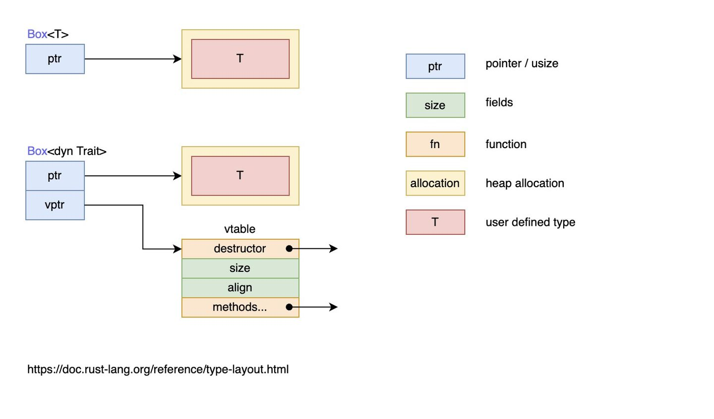

### 泛型Generics

用同一功能的函数处理不同类型的数据

```rust
// 无法编译通过
fn add<T>(a:T, b:T) -> T {
    a + b
}

fn main() {
    println!("add i8: {}", add(2i8, 3i8));
    println!("add i32: {}", add(20, 30));
    println!("add f64: {}", add(1.23, 1.23));
}
```

#### 泛型详解

```rust
fn largest<T>(list: &[T]) -> T {}
```

- `T` 就是**泛型参数**
- `largest<T>` 对泛型参数 `T` 进行了声明，之后才在函数参数中使用该泛型参数 `list: &[T]`
  - `&[T]`为**数组切片**

> 因为 `T` 可以是任何类型，但不是所有的类型都能进行比较，所以需要使用**特征**对**泛型参数类型**增加限制
>
> - 如：`std::cmp::PartialOrd`特征让**类型实现可比较的功能**；
>
> ```rust
> fn largest<T: std::cmp::PartialOrd + Copy> -> T {} // 增加Copy特征约束使其通过编译
> fn largest<T: PartialOrd + Clone> -> T {} // 或使用Clone特征，但对于分配在堆上的数据来说性能不好
> fn largest<T: PartialOrd> -> &T { // 或修改函数体以及函数返回值为引用
>     let ref mut largest = &list[0];
>
>     for item in list.iter() {
>         if item > largest {
>             *largest = item;
>         }
>     }
>     largest
> }
> // 修复上述add函数
> fn add<T: std::ops::Add<Output=T>>(a: T, b: T) -> T {}
> ```

#### 结构体中使用泛型

结构体中的字段类型也可以用泛型来定义

* **提前声明** ，跟泛型函数定义类似，首先我们在使用泛型参数之前必需要进行声明 `Point<T>`，接着就可以在结构体的字段类型中使用 `T` 来替代具体的类型
* **x 和 y 是相同的类型**

```rust
struct Point<T> {
    x: T,
    y: T,
}

fn main() {
    let integer = Point { x: 5, y: 10 };
    let float = Point { x: 1.0, y: 4.0 };
}
```

- 如果想让 `x` 和 `y` 既能类型相同，又能类型不同，就需要使用不同的泛型参数

```rust
struct Point<T, U> {
    x: T,
    y: U,
}
fn main() {
    let p = Point{x: 1, y :1.1};
}
```

> **所有的泛型参数都要提前声明**

#### 枚举中的泛型

> ```rust
> enum Option<T> {
>     Some(T),
>     None,
> }
> ```
>
> `Option`即是一个泛型枚举类型，关注值存在与否
>
> ```rust
> enum Result<T, E> {
>     Ok(T),
>     Err(E),
> }
> ```
>
> `Result`关注值的正确性

#### 方法中的泛型

```rust
struct Point<T> {
    x: T,
    y: T,
}

impl<T> Point<T> {
    fn x(&self) -> &T {
        &self.x
    }
}

fn main() {
    let p = Point { x: 5, y: 10 };

    println!("p.x = {}", p.x());
}
```

- 使用泛型参数前，依然需要提前声明：`impl<T>`，只有提前声明了，才能在 `Point<T>`中使用
  - 这样Rust才不会解析 `Point<T>`中的 `T`是泛型而不是具体类型
- 这里的 `Point<T>` 不再是泛型声明，而是一个完整的结构体类型，因为我们定义的结构体就是 `Point<T>` 而不再是 `Point`

```rust
struct Point<T, U> {
    x: T,
    y: U,
}

impl<T, U> Point<T, U> {
    // 能在该结构体的方法中定义额外的泛型参数
    fn mixup<V, W>(self, other: Point<V, W>) -> Point<T, W> {
        Point {
            x: self.x,
            y: other.y,
        }
    }
}

fn main() {
    let p1 = Point { x: 5, y: 10.4 };
    let p2 = Point { x: "Hello", y: 'c'};

    let p3 = p1.mixup(p2);

    println!("p3.x = {}, p3.y = {}", p3.x, p3.y);
}
```

##### 为具体泛型类型实现方法

- 针对特定的泛型类型实现某个特定的方法，对于其它泛型类型则没有定义该方法

```rust
impl Point<f32> {
    // 意味着 Point<f32> 类型会有一个方法 distance_from_origin，而其他 T 不是 f32 类型的 Point<T> 实例则没有定义此方法
    fn distance_from_origin(&self) -> f32 {
        (self.x.powi(2) + self.y.powi(2)).sqrt()
    }
}
```

#### const泛型

- 针对值的泛型

```rust
// 通过引用和数组切片解决不适用不同长度的数组
fn display_array<T: std::fmt::Debug>(arr: &[T]) {
    println!("{:?}", arr);
}

fn main() {
    let arr: [i32; 3] = [1, 2, 3];
    display_array(&arr);

    let arr: [i32; 2] = [1, 2];
    display_array(&arr);
}

// 通过const泛型解决
fn display_array<T: std::fmt::Debug, const N: usize>(arr: [T; N]) {
    println!("{:?}", arr);
}
fn main() {
    let arr: [i32; 3] = [1, 2, 3];
    display_array(arr);

    let arr: [i32; 2] = [1, 2];
    display_array(arr);
}
```

- 定义了一个类型为 `[T; N]` 的数组，其中 `T` 是一个基于类型的泛型参数，`N`为基于值的泛型参数，用来替代数组的长度，通过 `const N: usize`定义

##### const泛型表达式

```rust
// 目前只能在nightly版本下使用
#![allow(incomplete_features)]
#![feature(generic_const_exprs)]

fn something<T>(val: T)
where
    Assert<{ core::mem::size_of::<T>() < 768 }>: IsTrue,
    //       ^-----------------------------^ 这里是一个 const 表达式，换成其它的 const 表达式也可以
{
    //
}

fn main() {
    something([0u8; 0]); // ok
    something([0u8; 512]); // ok
    something([0u8; 1024]); // 编译错误，数组长度是1024字节，超过了768字节的参数长度限制
}

// ---

pub enum Assert<const CHECK: bool> {
    //
}

pub trait IsTrue {
    //
}

impl IsTrue for Assert<true> {
    //

```

const 泛型参数只能使用以下形式的实参:

* 一个单独的 const 泛型参数
* 一个字面量 (i.e. 整数, 布尔值或字符).
* 一个具体的 const 表达式( 表达式中不能包含任何 泛型参数)

```rust
fn foo<const N: usize>() {}

fn bar<T, const M: usize>() {
    foo::<M>(); // ok: 符合第一种
    foo::<2021>(); // ok: 符合第二种
    foo::<{20 * 100 + 20 * 10 + 1}>(); // ok: 符合第三种
  
    foo::<{ M + 1 }>(); // error: 违背第三种，const 表达式中不能有泛型参数 M
    foo::<{ std::mem::size_of::<T>() }>(); // error: 泛型表达式包含了泛型参数 T
  
    let _: [u8; M]; // ok: 符合第一种
    let _: [u8; std::mem::size_of::<T>()]; // error: 泛型表达式包含了泛型参数 T
}

fn main() {}
```

const泛型来实现一个结构体，该结构体的字段中的数组长度是可变的

```rust
struct ArrayPair<T, const N: usize> {
    left: [T; N],
    right: [T; N],
}

impl<T: Debug, const N: usize> Debug for ArrayPair<T, N> {
    // ...
}
```

用const泛型避免一些运行时检查，提升性能

```rust
pub struct MinSlice<T, const N: usize> {
    pub head: [T; N],
    pub tail: [T],
}

fn main() {
    let slice: &[u8] = b"Hello, world";
    let reference: Option<&u8> = slice.get(6);
    // 我们知道 `.get` 返回的是 `Some(b' ')`
    // 但编译器不知道
    assert!(reference.is_some());

    let slice: &[u8] = b"Hello, world";

    // 当编译构建 MinSlice 时会进行长度检查，也就是在编译期我们就知道它的长度是 12
    // 在运行期，一旦 `unwrap` 成功，在 `MinSlice` 的作用域内，就再无需任何检查  
    let minslice = MinSlice::<u8, 12>::from_slice(slice).unwrap();
    let value: u8 = minslice.head[6];
    assert_eq!(value, b' ')
}
```

#### 泛型的性能

- 在 Rust 中泛型是零成本的抽象，不用担心性能问题（没有运行时开销）
- Rust 是在编译期为泛型对应的多个类型，生成各自的代码，损失了编译速度和增大了最终生成文件的大小
  - Rust 通过在编译时进行泛型代码的**单态化** ( *monomorphization* )来保证效率
  - 单态化是一个通过填充编译时使用的具体类型，将通用代码转换为特定代码的过程

```rust
let integer = Some(5);
let float = Some(5.0);

// 单态化后
enum Option_i32 {
    Some(i32),
    None,
}

enum Option_f64 {
    Some(f64),
    None,
}

fn main() {
    let integer = Option_i32::Some(5);
    let float = Option_f64::Some(5.0);
}
```

### 特征trait

把类型行为抽象出来

特征定义了**一组可以被共享的行为，只要实现了特征，你就能使用这组行为**

```rust
#[derive(Debug)]

fn add<T: std::ops::Add<Output = T>>(a:T, b:T) -> T {
    a + b
}
```

如果不同的类型具有相同的行为，那么我们就可以定义一个特征，然后为这些类型实现该特征

#### 定义特征

> **定义特征**是把一些方法组合在一起，目的是定义一个实现某些目标所必需的行为的集合
>
> ```rust
> pub trait Summary {
>     fn summarize(&self) -> String;
> }
> ```
>
> 使用 `trait`关键字声明一个特征，`Summary`是特征名，`fn summarize(&self) -> String`是该特征所有的方法

- 只定义特征方法的签名，而不进行实现，此时方法签名结尾是 `;`，而不是一个 `{}`
- 每一个实现这个特征的类型都需要具体实现该特征的相应方法
- 编译器会确保任何实现 `Summary` 特征的类型都拥有与这个签名的定义完全一致的 `summarize` 方法

#### 为类型实现特征

```rust
pub trait Summary { // pub公开，外部可引入使用
    fn summarize(&self) -> String;
}

pub struct Post {
    pub title: String, // 标题
    pub author: String, // 作者
    pub content: String, // 内容
}

impl Summary for Post {
    fn summarize(&self) -> String {
        format!("文章{}, 作者是{}", self.title, self.author)
    }
}

pub struct Weibo {
    pub username: String,
    pub content: String
}

impl Summary for Weibo {
    fn summarize(&self) -> String {
        format!("{}发表了微博{}", self.username, self.content)
    }
}

fn main() {
    let post = Post{title: "Rust语言简介".to_string(),author: "Sunface".to_string(), content: "Rust棒极了!".to_string()};
    let weibo = Weibo{username: "sunface".to_string(),content: "好像微博没Tweet好用".to_string()};

    println!("{}",post.summarize());
    println!("{}",weibo.summarize());
}
```

##### 特征的定义与实现的位置（孤儿规则）

> ****孤儿规则** -- 如果你想要为类型** `A` **实现特征** `T`**，那么** `A` **或者** `T` **至少有一个是在当前作用域中定义的**
>
> 确保其它人编写的代码不会破坏你的代码，也确保了你不会莫名其妙就破坏了不相及的代码

##### 默认实现

可以在特征中定义具有**默认实现**的方法，这样其它类型无需再实现该方法，或者也可以选择重载该方法

```rust
pub trait Summary {
    fn summarize(&self) -> String {
        String::from("(Read more...)")
    }
}

pub struct Post {
    pub title: String, // 标题
    pub author: String, // 作者
    pub content: String, // 内容
}

pub struct Weibo {
    pub username: String,
    pub content: String
}

impl Summary for Post {}

impl Summary for Weibo {
    fn summarize(&self) -> String {
        format!("{}发表了微博{}", self.username, self.content)
    }
}

fn main() {
    let post = Post{title: "Rust语言简介".to_string(),author: "Sunface".to_string(), content: "Rust棒极了!".to_string()};
    let weibo = Weibo{username: "sunface".to_string(),content: "好像微博没Tweet好用".to_string()};
    println!("{}",post.summarize());
    println!("{}",weibo.summarize());
}
```

默认实现允许调用相同特征中的其他方法，哪怕这些方法没有默认实现

- 提供很多有用的功能而只需要实现指定的一小部分内容

```rust
pub trait Summary {
    fn summarize_author(&self) -> String;

    fn summarize(&self) -> String {
        format!("(Read more from {}...)", self.summarize_author())
    }
}

impl Summary for Weibo {
    fn summarize_author(&self) -> String {
        format!("@{}", self.username)
    }
}

println!("1 new weibo: {}", weibo.summarize());
// 会先调用 Summary 特征默认实现的 summarize 方法
// 通过该方法进而调用 Weibo 为 Summary 实现的 summarize_author 方法
// 最终输出：1 new weibo: (Read more from @horse_ebooks...)
```

#### 使用特征作为函数参数

```rust
pub fn notify(item: &impl Summary) {
    println!("Breaking news! {}", item.summarize());
}
```

* **实现了 `Summary`特征** 的 `item` 参数
* 可以使用任何实现了 `Summary` 特征的类型作为该函数的参数，同时在函数体内，还可以调用该特征的方法

#### 特征约束

- `impl Trait`语法糖，实际写法：

```rust
pub fn notify<T: Summary>(item: &T) {
    println!("Breaking news! {}", item.summarize());
}
```

> `T: Summary` 被称为**特征约束**
>
> 特征约束可以让我们拥有更大的灵活性和语法表现能力

```rust
pub fn notify(item1: &impl Summary, item2: &impl Summary) {}
pub fn notify<T: Summary>(item1: &T, item2: &T) {}
```

##### 多重约束

指定多个约束条件

```rust
pub fn notify(item: &(impl Summary + Display)) {}
pub fn notify<T: Summary + Display>(item: &T) {}
```

##### where约束

通过 `where`改进多个多个特征约束带来的签名复杂

```rust
fn some_function<T: Display + Clone, U: Clone + Debug>(t: &T, u: &U) -> i32 {}

fn some_function<T, U>(t: &T, u: &U) -> i32
    where T: Display + Clone,
          U: Clone + Debug
{}
```

##### 使用特征约束有条件地实现方法或特征

指定类型 + 指定特征的条件下去实现方法

```rust
use std::fmt::Display;

struct Pair<T> {
    x: T,
    y: T,
}

impl<T> Pair<T> {
    fn new(x: T, y: T) -> Self {
        Self {
            x,
            y,
        }
    }
}

impl<T: Display + PartialOrd> Pair<T> {
    fn cmp_display(&self) {
        if self.x >= self.y {
            println!("The largest member is x = {}", self.x);
        } else {
            println!("The largest member is y = {}", self.y);
        }
    }
}

// 仅当Unit作为Pair成员派生了Display + PartialOrd才实现cmp_display方法
#[derive(PartialEq, PartialOrd, Display)]
struct Unit(i32);

fn main() {
    let pair = Pair{
        x: Unit(1),
        y: Unit(3)
    };

    pair.cmp_display();
}
```

**有条件地实现特征**

```rust
// 标准库内为任何实现了Display的类型都实现了ToString特征
impl<T: Display> ToString for T {
    // --snip--
}
// 因此可以对任何实现了 Display 特征的类型调用由 ToString 定义的方法（如to_string）
let s = 3.to_string();
```

#### 函数返回中的 `impl Trait`

通过 `impl Trait` 来说明一个函数返回了一个类型，该类型实现了某个特征

```rust
fn returns_summarizable() -> impl Summary {
    Weibo {
        username: String::from("sunface"),
        content: String::from(
            "m1 max太厉害了，电脑再也不会卡",
        )
    }
}
```

- 当返回的真实类型非常复杂，你不知道该怎么声明时(毕竟 Rust 要求你必须标出所有的类型)，此时就可以用 `impl Trait` 的方式简单返回
  - 闭包和迭代器就是很复杂，只有编译器才知道那玩意的真实类型，可以用 `impl Iterator` 来告诉调用者，返回了一个迭代器，因为所有迭代器都会实现 `Iterator` 特征
- 限制：只能有一个具体的类型

```rust
fn returns_summarizable(switch: bool) -> impl Summary {
    if switch {
        Post {
            title: String::from(
                "Penguins win the Stanley Cup Championship!",
            ),
            author: String::from("Iceburgh"),
            content: String::from(
                "The Pittsburgh Penguins once again are the best \
                 hockey team in the NHL.",
            ),
        }
    } else {
        Weibo {
            username: String::from("horse_ebooks"),
            content: String::from(
                "of course, as you probably already know, people",
            ),
        }
    }
}
// Error
```

- 想要返回不同的类型需要使用**特征对象**

#### 通过derive派生特征

- 特征派生语法 -- 形如 `#[derive(Debug)]`
  - 被 `derive` 标记的对象会自动实现对应的默认特征代码，继承相应的功能
- `derive` 派生出来的是 Rust 默认给我们提供的特征，在开发过程中极大的简化了自己手动实现相应特征的需求
  - 可以自己手动重载该实现

#### 调用方法需要引入特征

使用 `as` 关键字做类型转换会有比较大的限制，因为你想要在类型转换上拥有完全的控制，将需要 `TryInto`

```rust
use std::convert::TryInto;

fn main() {
  let a: i32 = 10;
  let b: u16 = 100;

  let b_ = b.try_into()
            .unwrap();

  if a < b_ {
    println!("Ten is less than one hundred.");
  }
}
```

> **如果你要使用一个特征的方法，那么你需要将该特征引入当前的作用域中**
>
> * 不过 `TryInto`在 `std::prelude`中，所以这个例子中不引用也行（仅在Edition 2021后）

#### 综合例子

##### 为自定义类型实现+操作

```rust
use std::ops::Add;

// 为Point结构体派生Debug特征，用于格式化输出
#[derive(Debug)]
struct Point<T: Add<T, Output = T>> { //限制类型T必须实现了Add特征，否则无法进行+操作。
    x: T,
    y: T,
}

impl<T: Add<T, Output = T>> Add for Point<T> {
    type Output = Point<T>;

    fn add(self, p: Point<T>) -> Point<T> {
        Point{
            x: self.x + p.x,
            y: self.y + p.y,
        }
    }
}

fn add<T: Add<T, Output=T>>(a:T, b:T) -> T {
    a + b
}

fn main() {
    let p1 = Point{x: 1.1f32, y: 1.1f32};
    let p2 = Point{x: 2.1f32, y: 2.1f32};
    println!("{:?}", add(p1, p2));

    let p3 = Point{x: 1i32, y: 1i32};
    let p4 = Point{x: 2i32, y: 2i32};
    println!("{:?}", add(p3, p4));
}
```

##### 自定义类型的打印输出

```rust
#![allow(dead_code)]

use std::fmt;
use std::fmt::{Display};

#[derive(Debug,PartialEq)]
enum FileState {
  Open,
  Closed,
}

#[derive(Debug)]
struct File {
  name: String,
  data: Vec<u8>,
  state: FileState,
}

impl Display for FileState {
   fn fmt(&self, f: &mut fmt::Formatter) -> fmt::Result {
     match *self {
         FileState::Open => write!(f, "OPEN"),
         FileState::Closed => write!(f, "CLOSED"),
     }
   }
}

impl Display for File {
   fn fmt(&self, f: &mut fmt::Formatter) -> fmt::Result {
      write!(f, "<{} ({})>",
             self.name, self.state)
   }
}

impl File {
  fn new(name: &str) -> File {
    File {
        name: String::from(name),
        data: Vec::new(),
        state: FileState::Closed,
    }
  }
}

fn main() {
  let f6 = File::new("f6.txt");
  //...
  println!("{:?}", f6);
  println!("{}", f6);
}
```

##### 特征约束类型为闭包

```rust
fn example1() {
    // `T: Trait` 是最常使用的方式
    // `T: Fn(u32) -> u32` 说明 `T` 只能接收闭包类型的参数
    struct Cacher<T: Fn(u32) -> u32> {
        calculation: T,
        value: Option<u32>,
    }

    impl<T: Fn(u32) -> u32> Cacher<T> {
        fn new(calculation: T) -> Cacher<T> {
            Cacher {
                calculation,
                value: None,
            }
        }

        fn value(&mut self, arg: u32) -> u32 {
            match self.value {
                Some(v) => v,
                None => {
                    let v = (self.calculation)(arg);
                    self.value = Some(v);
                    v
                },
            }
        }
    }

    let mut cacher = Cacher::new(|x| x+1);
    assert_eq!(cacher.value(10), 11);
    assert_eq!(cacher.value(15), 11);
}


fn example2() {
    // 还可以使用 `where` 来约束 T
    struct Cacher<T>
        where T: Fn(u32) -> u32,
    {
        calculation: T,
        value: Option<u32>,
    }

    impl<T> Cacher<T>
        where T: Fn(u32) -> u32,
    {
        fn new(calculation: T) -> Cacher<T> {
            Cacher {
                calculation,
                value: None,
            }
        }

        fn value(&mut self, arg: u32) -> u32 {
            match self.value {
                Some(v) => v,
                None => {
                    let v = (self.calculation)(arg);
                    self.value = Some(v);
                    v
                },
            }
        }
    }

    let mut cacher = Cacher::new(|x| x+1);
    assert_eq!(cacher.value(20), 21);
    assert_eq!(cacher.value(25), 21);
}


fn main() {
    example1();
    example2();

    println!("Success!")
}
```

### 特征对象

`impl Trait` 的返回值类型并不支持多种不同的类型返回，那如果想返回多种类型，该怎么办？

#### 特征对象定义

```rust
pub trait Draw {
    fn draw(&self);
}

pub struct Button {
    pub width: u32,
    pub height: u32,
    pub label: String,
}

impl Draw for Button {
    fn draw(&self) {
        // 绘制按钮的代码
    }
}

struct SelectBox {
    width: u32,
    height: u32,
    options: Vec<String>,
}

impl Draw for SelectBox {
    fn draw(&self) {
        // 绘制SelectBox的代码
    }
}

// 动态数组存储UI组件
pub struct Screen {
    // pub components: Vec<?>,
    pub components: Vec<Box<dyn Draw>>, // 里面元素的类型是 Draw 特征对象：Box<dyn Draw>，任何实现了 Draw 特征的类型，都可以存放其中
}

// 为 Screen 定义 run 方法，用于将列表中的 UI 组件渲染在屏幕上
impl Screen {
    pub fn run(&self) {
        for component in self.components.iter() {
            component.draw();
        }
    }
}

fn main() {
    let screen = Screen {
        components: vec![
            Box::new(SelectBox {
                width: 75,
                height: 10,
                options: vec![
                    String::from("Yes"),
                    String::from("Maybe"),
                    String::from("No")
                ],
            }),
            Box::new(Button {
                width: 50,
                height: 10,
                label: String::from("OK"),
            }),
        ],
    };

    screen.run();
}
```

> ? -> 因为 `Button` 和 `SelectBox` 都实现了 `Draw` 特征，可以把 `Draw` 特征的对象作为类型，填入到数组中
>
> **特征对象**指向实现了 `Draw` 特征的类型的实例，也就是指向了 `Button` 或者 `SelectBox` 的实例，这种映射关系是存储在一张表中，可以在运行时通过特征对象找到具体调用的类型方法
>
> 通过 `&` 引用或者 `Box<T>` 智能指针的方式来创建特征对象

```rust
trait Draw {
    fn draw(&self) -> String;
}

impl Draw for u8 {
    fn draw(&self) -> String {
        format!("u8: {}", *self)
    }
}

impl Draw for f64 {
    fn draw(&self) -> String {
        format!("f64: {}", *self)
    }
}

// 若 T 实现了 Draw 特征， 则调用该函数时传入的 Box<T> 可以被隐式转换成函数参数签名中的 Box<dyn Draw>
fn draw1(x: Box<dyn Draw>) {
    // 由于实现了 Deref 特征，Box 智能指针会自动解引用为它所包裹的值，然后调用该值对应的类型上定义的 `draw` 方法
    x.draw();
}

fn draw2(x: &dyn Draw) {
    x.draw();
}

fn main() {
    let x = 1.1f64;
    // do_something(&x);
    let y = 8u8;

    // x 和 y 的类型 T 都实现了 `Draw` 特征，因为 Box<T> 可以在函数调用时隐式地被转换为特征对象 Box<dyn Draw> 
    // 基于 x 的值创建一个 Box<f64> 类型的智能指针，指针指向的数据被放置在了堆上
    draw1(Box::new(x));
    // 基于 y 的值创建一个 Box<u8> 类型的智能指针
    draw1(Box::new(y));
    draw2(&x);
    draw2(&y);
}
```

* `draw1` 函数的参数是 `Box<dyn Draw>` 形式的特征对象，该特征对象是通过 `Box::new(x)` 的方式创建的
* `draw2` 函数的参数是 `&dyn Draw` 形式的特征对象，该特征对象是通过 `&x` 的方式创建的
* `dyn` 关键字只用在特征对象的类型声明上，在创建时无需使用 `dyn`

通过泛型实现：

```rust
pub struct Screen<T: Draw> {
    pub components: Vec<T>,
}

impl<T> Screen<T>
    where T: Draw {
    pub fn run(&self) {
        for component in self.components.iter() {
            component.draw();
        }
    }
}
```

> 这种写法限制了 `Screen` 实例的 `Vec<T>` 中的每个元素必须是相同类型
>
> 如果只需要同质（相同类型）集合，更倾向于采用泛型+特征约束这种写法，因其实现更清晰，且性能更好(特征对象，需要在运行时从 `vtable` 动态查找需要调用的方法)
>
> **鸭子类型** ( *duck typing* )，简单来说，就是只关心值长啥样，而不关心它实际是什么
>
> - 当一个东西走起来像鸭子，叫起来像鸭子，那么它就是一只鸭子，就算它实际上是一个奥特曼，也不重要，我们就当它是鸭子
>
> 使用特征对象和 Rust 类型系统来进行类似鸭子类型操作的优势是，无需在运行时检查一个值是否实现了特定方法或者担心在调用时因为值没有实现方法而产生错误
>
> 注意 `dyn` 不能单独作为特征对象的定义
>
> - 原因是特征对象可以是任意实现了某个特征的类型，编译器在编译期不知道该类型的大小，不同的类型大小是不同的
> - 而 `&dyn` 和 `Box<dyn>` 在编译期都是已知大小，所以可以用作特征对象的定义

#### 特征对象的动态分发

> 泛型是在编译期完成处理的：编译器会为每一个泛型参数对应的具体类型生成一份代码，这种方式是 **静态分发(static dispatch)** ，因为是在编译期完成的，对于运行期性能完全没有任何影响
>
> **动态分发(dynamic dispatch)** -- 直到运行时，才能确定需要调用什么方法
>
> * `dyn`关键字
> * 当使用特征对象时，Rust 必须使用动态分发
> * 编译器无法知晓所有可能用于特征对象代码的类型，所以它也不知道应该调用哪个类型的哪个方法实现。为此，Rust 在运行时使用特征对象中的指针来知晓需要调用哪个方法
> * 动态分发也阻止编译器有选择的内联方法代码，这会相应的禁用一些优化
>
> 
>
> * **特征对象大小不固定** ：这是因为，对于特征 `Draw`，类型 `Button` 可以实现特征 `Draw`，类型 `SelectBox` 也可以实现特征 `Draw`，因此特征没有固定大小
> * **几乎总是使用特征对象的引用方式** ，如 `&dyn Draw`、`Box<dyn Draw>`
>   * 虽然特征对象没有固定大小，但它的引用类型的大小是固定的，它由两个指针组成（`ptr` 和 `vptr`），因此占用两个指针大小
>   * 一个指针 `ptr` 指向实现了特征 `Draw` 的具体类型的实例，也就是当作特征 `Draw` 来用的类型的实例，比如类型 `Button` 的实例、类型 `SelectBox` 的实例
>   * 另一个指针 `vptr` 指向一个虚表 `vtable`，`vtable` 中保存了类型 `Button` 或类型 `SelectBox` 的实例对于可以调用的实现于特征 `Draw` 的方法。当调用方法时，直接从 `vtable` 中找到方法并调用。之所以要使用一个 `vtable` 来保存各实例的方法，是因为实现了特征 `Draw` 的类型有多种，这些类型拥有的方法各不相同，当将这些类型的实例都当作特征 `Draw` 来使用时(此时，它们全都看作是特征 `Draw` 类型的实例)，有必要区分这些实例各自有哪些方法可调用
>
> 注意：`x`为 `Y`特征的特征对象的实例，而不再是具体类型 `X`的实例，而且 `x`的 `vtable`只包含了实现自特征 `Y`的那些方法，因此 `x`只能调用实现于特征 `Y`的方法，而不能调用类型 `X`本身实现的方法和类型 `X`实现于其它特征的方法

#### self与Self

在 Rust 中，有两个 `self`，一个指代当前的实例对象，一个指代特征或者方法类型的别名

```rust
trait Draw {
    fn draw(&self) -> Self;
}

#[derive(Clone)]
struct Button;
impl Draw for Button {
    fn draw(&self) -> Self {
        return self.clone()
    }
}

fn main() {
    let button = Button;
    let newb = button.draw();
}
```

#### 特征对象的限制

> 不是所有特征都能拥有特征对象，只有对象安全的特征才行
>
> 一个特征的所有方法都有如下属性时：
>
> * 方法的返回类型不能是 `Self`
> * 方法没有任何泛型参数
>
> 它的对象才是安全的
>
> 对象安全对于特征对象是必须的，因为一旦有了特征对象，就不再需要知道实现该特征的具体类型是什么了

### 深入了解特征

#### 关联类型

关联类型是在特征定义的语句块中，声明一个自定义类型，这样就可以在特征的方法签名中使用该类型

```rust
// 标准库中的迭代器特征 Iterator，它有一个 Item 关联类型，用于替代遍历的值的类型
pub trait Iterator {
    type Item;

    fn next(&mut self) -> Option<Self::Item>;
}
```

- **`Self` 用来指代当前调用者的具体类型，那么 `Self::Item` 就用来指代该类型实现中定义的 `Item` 类型**
- 相比泛型，关联类型代码更易读

```rust
trait Container<A,B> {
    fn contains(&self,a: A,b: B) -> bool;
}

fn difference<A,B,C>(container: &C) -> i32
  where
    C : Container<A,B> {...}


trait Container{
    type A;
    type B;
    fn contains(&self, a: &Self::A, b: &Self::B) -> bool;
}

fn difference<C: Container>(container: &C) {}
```

#### 默认泛型类型参数

当使用泛型类型参数时，可以为其指定一个默认的具体类型

```rust
trait Add<RHS=Self> {
    type Output;

    fn add(self, rhs: RHS) -> Self::Output;
}
```

- 泛型参数 `RHS`，并给它一个默认值，当用户不指定 `RHS` 时，默认使用两个同样类型的值进行相加，然后返回一个关联类型 `Output`

```rust
use std::ops::Add;

#[derive(Debug, PartialEq)]
struct Point {
    x: i32,
    y: i32,
}

impl Add for Point {
    type Output = Point;

    fn add(self, other: Point) -> Point {
        Point {
            x: self.x + other.x,
            y: self.y + other.y,
        }
    }
}

fn main() {
    assert_eq!(Point { x: 1, y: 0 } + Point { x: 2, y: 3 },
               Point { x: 3, y: 3 });
}
```

- 没有为 `Point` 实现 `Add<RHS>` 特征，而是实现了 `Add` 特征（没有默认泛型类型参数），这意味着我们使用了 `RHS` 的默认类型，也就是 `Self`

```rust
use std::ops::Add;

struct Millimeters(u32);
struct Meters(u32);

impl Add<Meters> for Millimeters {
    type Output = Millimeters;

    fn add(self, other: Meters) -> Millimeters {
        Millimeters(self.0 + (other.0 * 1000))
    }
}
```

- 使用 `Add<Meters>` 将 `RHS` 指定为 `Meters`实现不同类型的相加

默认类型参数主要用于两个方面：

1. 减少实现的样板代码
2. 扩展类型但是无需大幅修改现有的代码

#### 调用同名方法

```rust
trait Pilot {
    fn fly(&self);
}

trait Wizard {
    fn fly(&self);
}

struct Human;

impl Pilot for Human {
    fn fly(&self) {
        println!("This is your captain speaking.");
    }
}

impl Wizard for Human {
    fn fly(&self) {
        println!("Up!");
    }
}

impl Human {
    fn fly(&self) {
        println!("*waving arms furiously*");
    }
}

```

##### 优先调用类型上的方法

编译器默认调用该类型中定义的方法

```rust
fn main() {
    let person = Human; // 打印 *waving arms furiously*
    person.fly();
}
```

##### 调用特征上的方法

为了能够调用特征的方法，需要使用显式调用的语法

```rust
fn main() {
    let person = Human;
    Pilot::fly(&person); // 调用Pilot特征上的方法
    Wizard::fly(&person); // 调用Wizard特征上的方法
    person.fly(); // 调用Human类型自身的方法
}
```

- 因为 `fly` 方法的参数是 `self`，当显式调用时，编译器就可以根据调用的类型( `self` 的类型)决定具体调用哪个方法

##### 完全限定语法

倘若为关联函数（没有 `self`参数）需要使用**完全限定语法**指定

```rust
<Type as Trait>::function(receiver_if_method, next_arg, ...);
```

- 调用函数最为明确的方式
- 可以用于任何函数或方法调用
- Rust 编译器能根据上下文自动推导出调用的路径，因此大多数时候，我们都无需使用完全限定语法
- 用于存在多个同名函数或方法，且 Rust 无法区分出你想调用的目标函数时

```rust
trait Animal {
    fn baby_name() -> String;
}

struct Dog;

impl Dog {
    fn baby_name() -> String {
        String::from("Spot")
    }
}

impl Animal for Dog {
    fn baby_name() -> String {
        String::from("puppy")
    }
}

fn main() {
    println!("A baby dog is called a {}", <Dog as Animal>::baby_name());
}
```

#### 特征定义中的特征约束

> 需要让某个特征 A 能使用另一个特征 B 的功能(另一种形式的特征约束)，这种情况下，不仅仅要为类型实现特征 A，还要为类型实现特征 B 才行，这就是 `supertrait`

```rust
use std::fmt::Display;

trait OutlinePrint: Display {
    fn outline_print(&self) {
        let output = self.to_string();
        let len = output.len();
        println!("{}", "*".repeat(len + 4));
        println!("*{}*", " ".repeat(len + 2));
        println!("* {} *", output);
        println!("*{}*", " ".repeat(len + 2));
        println!("{}", "*".repeat(len + 4));
    }
}

struct Point {
    x: i32,
    y: i32,
}

impl OutlinePrint for Point {}

impl Display for Point {
    fn fmt(&self, f: &mut fmt::Formatter) -> fmt::Result {
        write!(f, "({}, {})", self.x, self.y)
    }
}

```

- `OutlinePrint: Display`类似特征约束，但是用在另一个特征上
  - 如果想要实现 `OutlinePrint` 特征，首先你需要实现 `Display` 特征，否则`self.to_string()`无法运行

#### 在外部类型上实现外部特征

绕过孤儿规则，那就是使用**newtype模式**

- 为一个元组结构体创建新类型。该元组结构体封装有一个字段，该字段就是希望实现特征的具体类型
- 该封装类型是本地的，因此我们可以为此类型实现外部的特征
- 运行时没有任何性能损耗，因为在编译期，该类型会被自动忽略

```rust
use std::fmt;

struct Wrapper(Vec<String>);

impl fmt::Display for Wrapper {
    fn fmt(&self, f: &mut fmt::Formatter) -> fmt::Result {
        write!(f, "[{}]", self.0.join(", "))
    }
}

fn main() {
    let w = Wrapper(vec![String::from("hello"), String::from("world")]);
    println!("w = {}", w);
}
```

- 注意：任何数组上的方法都需要先从元组结构体中取出数组，然后再进行调用
- 或为该 `newtype`实现 `Deref`特征 -- 自动做一层类似类型转换的操作，将 `Wrapper` 变成 `Vec<String>` 来使用
- 如果不想 `Wrapper` 暴露底层数组的所有方法，我们还可以为 `Wrapper` 去重载这些方法，实现隐藏的目的
