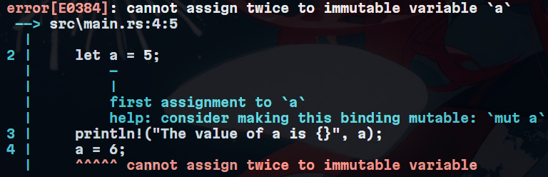

## 变量绑定与解构

### 手动设置变量的可变性

- 即支持声明可变的变量（灵活性），也支持声明不可变的变量（安全性）
  - 性能提升 -- 将本身无需改变的变量声明为不可变可以避免运行期时不必要的runtime检查

### 变量绑定

- **变量绑定** `let var = "hello,world!"`
  - 绑定 -> **所有权** -> 所有内存对象存在并完全属于一个主人，将内存对象与变量绑定让其成为它的主人，同时该内存对象之前的主人丧失对其的所有权

### 变量可变性

- Rust变量在默认情况下时**不可变的**
- 通过 `mut`关键字让变量变为（值）**可变的**



- 无法对不可变变量进行二次赋值
- 避免假定变量不可变的代码段由于其它代码段的无情赋值改变了变量值导致计算出错（多线程）
- 变量名前显式声明 `mut`使其可变，避免每次改变重新生成一个变量（大量内存拷贝，性能低下）

  - 表明告知这个变量后续值会发生改变
- 下划线开头命名变量，表明Rust在这个变量未使用时不需要发出警告

  ```rust
  fn main() {
      let _x = 1;
      let y = 2;
  }

  /*
  warning: unused variable: `y`
   --> src\main.rs:9:9
    |
  9 |     let y = 2;
    |         ^ help: if this is intentional, prefix it with an underscore: `_y`
    |
    = note: `#[warn(unused_variables)]` on by default

  warning: `variables` (bin "variables") generated 1 warning (run `cargo fix --bin "variables"` to apply 1 suggestion)
  */
  ```

### 变量解构

- `let`不仅用于变量绑定，还用于复杂变量的解构
  - 变量结构：从一个相对复杂的变量中，匹配出该变量的一部分内容

#### 解构式赋值

```rust
// Rust 1.59后，支持在赋值语句的左式中使用元组、切片和结构体模式
struct Struct {
    e: i32;
}

fn main() {
    let (a, b, c, d, e);

    (a, b) = (1, 2);
    // _代表匹配一个值，但并不关心具体的值
    [c, .., d, _] = [1, 2, 3, 4, 5];
    Struct {e, ..} = {e, 5};

    assert_eq!([1, 2, 3, 4, 5], [a, b, c, d, e]);
}
```

- 相比于 `let`，这里仅仅是对之前绑定的变量进行再赋值，而非重新绑定
- 使用 `+=`的赋值语句还不支持解构式赋值

### 变量和常量的差异

* 常量不允许使用 `mut`
  * **常量不仅仅默认不可变，而且自始至终不可变** ，因为常量在编译完成后，已经确定它的值。
* 常量使用 `const` 关键字而不是 `let` 关键字来声明，并且值的类型**必须**标注
* 常量可以在任意作用域内声明，包括全局作用域，在声明的作用域内，常量在程序运行的整个过程中都有效
  * 适用于多处代码共享一个不可变变量

```rust
const MAX_POINTS: u32 = 100_000;
```

### 变量遮蔽

- 允许声明同名变量，但后声明的会遮蔽先前声明的

```rust
fn main() {
    let x = 5;
    // 在main函数的作用域之内对之前的x进行遮蔽
    let x = x + 1;

    {
        // 在当前花括号内，对之前的x进行遮蔽
        let x = x * 2;
        println!("The value of x in the inner scope is {}", x);
    }
  
    println!("The value of x is {}", x);
}
```

- 与 `mut`不同，第二个 `let`生成了完全不同的新变量，只是恰好同样的变量名，涉及一次内存对象的再分配
  - 而 `mut`声明的变量，可以修改同一内存地址上的值（不需要内存对象再分配），性能更好
- 变量遮蔽用于某个作用域内无需再使用之前的变量，就可以重复的使用变量的名字

```rust
// 字符串类型
let spaces = "    ";
// usize数值类型
let spaces = spaces.len();

// 不使用let重新绑定将会报错
let spaces = "    ";
spaces = spaces.len();

/*
error[E0308]: mismatched types
  --> src\main.rs:53:14
   |
52 |     let mut spaces = "    ";
   |                      ------ expected due to this value
53 |     spaces = spaces.len();
   |              ^^^^^^^^^^^^ expected `&str`, found `usize`
   |
help: try removing the method call
   |
53 -     spaces = spaces.len();
53 +     spaces = spaces;
   |

For more information about this error, try `rustc --explain E0308`.
*/
```

- Rust类型严格，不允许将整数类型赋值给字符串类型

---

## 基本类型

- Rust是静态类型语言，每个值数值类型分为两类：**基本类型**和**复合类型**

  - 基本类型往往是一个最小化原子类型，无法解构为其它类型（一般意义上来说）
- 基本类型：

  - 数值类型：有符号整数（`i8/i16/i32/i64/isize`）、无符号整数（`u8/u16/u32/u64/usize`）、浮点数（`f32/f64`）、有理数、负数
  - 字符串：字符串字面量和字符串切片 `&str`
  - 布尔类型：`true`和 `false`
  - 字符类型：表示单个Unicode字符，存储为4字节
  - 单元类型：`()`，其唯一值也是 `()`
- Rust编译器包含自动类型推导，但当Rust无法推导类型时也需要给变量显式类型标注

  ```rust
  // 编译器无法推导出guess的类型
  let guess = "42".parse().expect("Not a number!");

  // 给guess显式类型标注
  let guess: i32 = "42".parse().expect("Not a number!");
  let guess = "42".parse::<i32>().expect("Not a number!");

  let num: i32 = 6; // 类型标注
  let number = 6i32; // 通过类型后缀的方式类型标注
  ```
- Rust支持运算符重载

### 数值类型

#### 整数类型

- `isize`和 `usize`类型取决于程序运行的计算机位数：32位或64位
  - 主要用作集合的索引
- Rust整型默认使用 `i32`
- 当在debug模式编译时，Rust会检查**整型溢出**，若存在这些问题，则使程序在编译时*panic*崩溃
- 当使用 `--release` 参数进行release模式构建时，Rust**不**检测溢出。相反，当检测到整型溢出时，Rust会按照补码循环溢出（ *two’s complement wrapping* ）的规则处理
- 要显式处理可能的溢出，可以使用标准库针对原始数字类型提供的这些方法：
  - 使用 `wrapping_*` 方法在所有模式下都按照补码循环溢出规则处理，例如 `wrapping_add`

    ```rust
    fn main() {
        let a : u8 = 255;
        let b = a.wrapping_add(20);
        println!("{}", b);  // 19
    }
    ```
  - 如果使用 `checked_*` 方法时发生溢出，则返回 `None` 值
  - 使用 `overflowing_*` 方法返回该值和一个指示是否存在溢出的布尔值
  - 使用 `saturating_*` 方法，可以限定计算后的结果不超过目标类型的最大值或低于最小值

    ```rust
    assert_eq!(100u8.saturating_add(1), 101);
    assert_eq!(u8::MAX.saturating_add(127), u8::MAX);
    ```

#### 浮点类型

- 默认浮点类型是 `f64`
- 浮点数陷阱：
  - 浮点数往往是想要的数字的近似表达 -- 定长二进制编码精度问题无法准确表达
  - 浮点数的比较运算实现的是 `std::cmp::PartialEq`，而非 `std::cmp::Eq`，后者在其它数值类型上都有定义，导致其存在使用限制，如HashMap中要求作为Key值的类型要实现 `std::cmp:Eq`，因此浮点数无法用于HashMap的Key值
- 避免在浮点数上测试相等性
  ```rust
  fn main() {
    // 断言0.1 + 0.2与0.3相等，程序panic
    assert!(0.1 + 0.2 == 0.3);
  }

  // 如非进行比较，具体小于多少取决于想要的精度
  (0.1_f64 + 0.2 - 0.3).abs() < 0.00001
  ```
- 当结果在数学上可能存在未定义时，需要格外的小心
- NaN -- 浮点数对于未定义结果的处理返回
  - **所有跟 `NaN` 交互的操作，都会返回一个 `NaN`** ，而且 `NaN` 不能用来比较
  - `is_nan()`判断一个数值是否是NaN

#### 数字运算

```rust
fn main() {
    // 加法
    let sum = 5 + 10;

    // 减法
    let difference = 95.5 - 4.3;

    // 乘法
    let product = 4 * 30;

    // 除法
    let quotient = 56.7 / 32.2;

    // 求余
    let remainder = 43 % 5;

    // 编译器会进行自动推导，给予twenty i32的类型
    let twenty = 20;
    // 类型标注
    let twenty_one: i32 = 21;
    // 通过类型后缀的方式进行类型标注：22是i32类型
    let twenty_two = 22i32;

    // 只有同样类型，才能运算
    let addition = twenty + twenty_one + twenty_two;
    println!("{} + {} + {} = {}", twenty, twenty_one, twenty_two, addition);

    // 对于较长的数字，可以用_进行分割，提升可读性
    let one_million: i64 = 1_000_000;
    println!("{}", one_million.pow(2));

    // 定义一个f32数组，其中42.0会自动被推导为f32类型
    let forty_twos = [
        42.0,
        42f32,
        42.0_f32,
    ];

    // 打印数组中第一个值，并控制小数位为2位
    println!("{:.2}", forty_twos[0]);
}
```

#### 位运算

- 与&、或|、非!、异或^、（逻辑）左移<<、（算数）右移>>

#### 序列

- 生成连续数值：`1..5`生成1到4的连续数值，不包含5；`1..=5`生成1到5的连续数字，包含5

  - 只作用于数值和字符类型，因为它们可以连续，编译器能够检查该序列是否为空
  - 字符和数字值是Rust中仅用可以用于判断是否为空的类型

  ```rust
  for i in 1..=5:
      println!("{}", i);

  // 或用于字符
  for c in 'a'..='z':
      println!("{}", c);
  ```

---

Rust 中可以使用 As 来完成一个类型到另一个类型的转换，其最常用于将原始类型转换为其他原始类型，但是它也可以完成诸如将指针转换为地址、地址转换为指针以及将指针转换为其他指针等功能

---

* **类型转换必须是显式的**，Rust 永远也不会偷偷把你的 16bit 整数转换成 32bit 整数
* **Rust 的数值上可以使用方法**，例如你可以用以下方法来将 `13.14` 取整：`13.14_f32.round()`，在这里我们使用了类型后缀，因为编译器需要知道 `13.14` 的具体类型

#### 字符类型

- 所有的 `Unicode`值都可作为Rust字符，`Unicode `值的范围从 `U+0000 ~ U+D7FF `和 `U+E000 ~ U+10FFFF`
- 由于 `Unicode`都是四字节编码，因此字符类型也是占用4字节
- Rust 的字符只能用 `''` 来表示， `""` 用于表示字符串

```rust
fn main() {
    let x = '中';
    println!("字符'中'占用了{}字节的内存大小",std::mem::size_of_val(&x));
} // 字符'中'占用了4字节的内存大小
```

#### 布尔

- 布尔值占用1字节，可能值 `true`或 `false`
- 用于流程控制

```rust
fn main() {
    let t = true;

    let f: bool = false; // 使用类型标注,显式指定f的类型

    if f {
        println!("这是段毫无意义的代码");
    }
}
```

#### 单元类型

- 单元类型就是 `()`，唯一的值也是 `()`
- `fn main()`函数的返回值就是单元类型 `()`
  - 无返回值的函数在Rust中是**发散函数** -- 无法收敛
  - 常见的 `println!()`的返回值也是单元类型
- 可以用 `()` 作为 `map` 的值，表示我们不关注具体的值，只关注 `key`
  - 只作为一个值占位，并不占用任何内存
